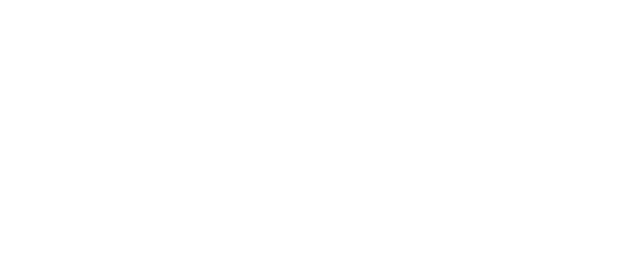

  
  
Modular agentic pipelines for document and data workflows

Trellis is a modular agentic pipeline system for document and data workflows. It provides a small, consistent DSL for composing tools into asynchronous DAGs, with strong validation and multi-tenant state management.

## Who it's for

- **Practitioners** — run reliable document pipelines (ingest → select → extract → compute → export)
- **Developers** — extend with custom tools, deterministic functions, and backends
- **Operators** — run via CLI or REST API with queueing and observability

## What you can do

- Ingest PDFs, web content, and spreadsheets; OCR image-only pages
- Retrieve and select relevant pages and snippets
- Extract structured fields and tables, or invoke LLM reasoning jobs
- Compute deterministic finance functions and derive fields
- Persist cross-run state to a tenant-scoped blackboard
- Export artifacts (markdown, CSV/XLSX, JSON) and integrate via API, CLI, or MCP

## Key concepts

- **Pipeline DSL** — flat task list; dependencies inferred from templates like `{{task_id.output}}`; explicit `await` when needed
- **Execution** — async DAG with fan-out via `parallel_over`, retries, per-task timeouts, and execution stats
- **ResolutionContext** — carries inputs, params, session state, `tenant_id`, and a blackboard handle through the run
- **Blackboard** — tenant-isolated persisted session store; `store` task writes are available to all downstream tasks in the same run
- **Tool Registry** — async discovery and registration; subclass `BaseTool` or register callables; built-ins cover ingest, select, extract, compute, `llm_job`, store, search, and export
- **Orchestrator** — builds context, discovers tools, executes pipeline, returns structured `RunResult`; background queue available
- **Interfaces** — FastAPI server, CLI, and MCP server

## Project structure

- `trellis/` — core models (Pydantic), validation, template resolution, blackboard, DAG executor, tool registry
- `trellis_api/` — FastAPI REST server (run, cancel, status, validate, tools listing)
- `trellis_cli/` — Typer-based CLI for validate and run, with per-run environment overrides
- `trellis_mcp/` — MCP server to expose tools via the Model Context Protocol

## Quick links

- [Installation](installation.md)
- [Quickstart](quickstart.md)
- [CLI reference](interfaces-cli.md)
- [API reference](interfaces-api.md)
- [Tools reference](tools-index.md)

## Next steps

Start with the [Quickstart](quickstart.md) to run an example pipeline end-to-end via CLI or API.
